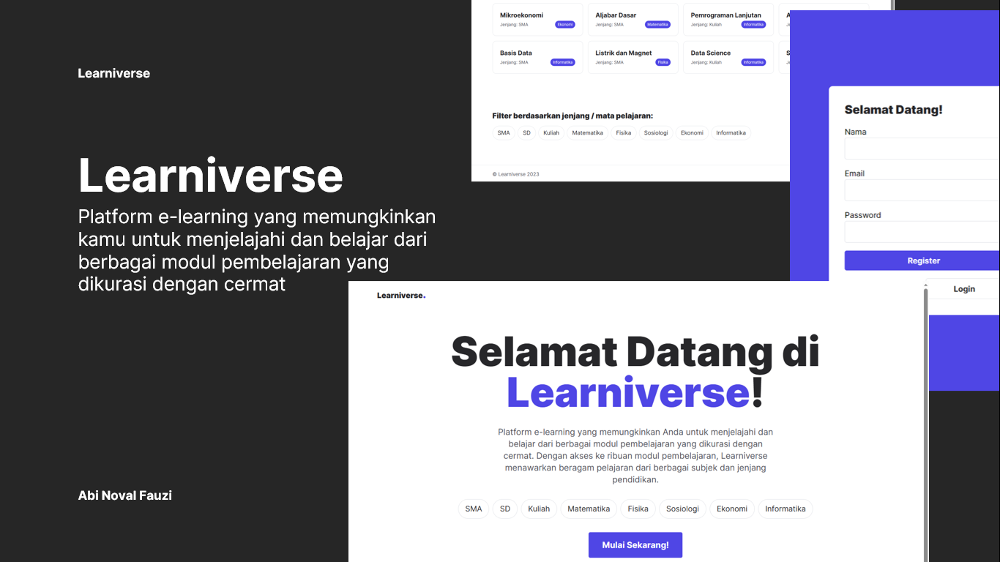

# Learniverse - Platform E-Learning Terlengkap
Bienvenue sur Learniverse - La plateforme d'apprentissage en ligne la plus complète ! Learniverse est une plateforme d'apprentissage en ligne révolutionnaire, dédiée à fournir à tous un accès à une éducation de qualité. Learniverse propose des milliers de modules d’apprentissage riches et variés, couvrant un large éventail de matières et de niveaux d’enseignement.

## Caractéristique principale

- **Authentification :** Learniverse fournit une fonction d'authentification qui permet aux utilisateurs de créer des comptes personnels et de se connecter à la plateforme en toute sécurité.
- **Recommandations de modules :** Learniverse utilise l'intelligence artificielle (IA) pour fournir des recommandations de modules d'apprentissage adaptées aux intérêts et à l'historique de lecture de l'utilisateur.
- **Filtre basé sur le niveau et le sujet/sujet :** Learniverse fournit des filtres qui permettent aux utilisateurs de rechercher des modules d'apprentissage en fonction du niveau d'éducation et du sujet/sujet.

## La poursuite du développement

Voici quelques-uns des développements prévus pour Learniverse :

1. **Validation des entrées :** Ajout d'une fonctionnalité de validation des entrées sur la plate-forme pour garantir une entrée valide et éviter les erreurs des utilisateurs.
2. **Développement de fonctionnalités de recommandation :** Continuer à développer la fonctionnalité de recommandation pour améliorer la personnalisation et la qualité des recommandations des modules d'apprentissage.
3. **Améliorations de la conception UI/UX :** Concentrez-vous sur l'amélioration de la conception UI/UX pour améliorer l'expérience utilisateur avec une mise en page intuitive, une navigation facile et un design attrayant.
4. **Mettre à jour le profil :** Ajout d'une fonctionnalité de mise à jour du profil qui permet aux utilisateurs d'organiser et de mettre à jour les informations de leur profil, telles que leur nom, leur photo de profil et leurs préférences utilisateur.
5. **Recherche de modules :** Ajout d'une fonctionnalité de recherche de modules qui permet aux utilisateurs de rechercher facilement des modules d'apprentissage en fonction de mots-clés.
6. **Questions pratiques :** Ajout d'une fonctionnalité de questions pratiques qui permet aux utilisateurs de tester leur compréhension avec des questions pratiques interactives liées aux modules d'apprentissage qu'ils ont étudiés.
7. **Gestion des utilisateurs par l'administrateur :** Ajout d'une fonctionnalité de gestion des utilisateurs par l'administrateur qui permet aux administrateurs de gérer les utilisateurs, notamment en créant de nouveaux comptes, en définissant des droits d'accès et en supprimant des comptes.

## Comment utiliser

### Connectez-vous au compte Learniverse

1. Ouvrez Learniverse dans un navigateur Web.
2. Cliquez sur le bouton « Connexion » dans le coin supérieur droit de la page.
3. Saisissez l'adresse e-mail et le mot de passe que vous avez enregistrés lors de la création d'un compte (si vous n'avez pas de compte, veuillez cliquer sur s'inscrire).
4. Cliquez sur le bouton « Connexion » pour vous connecter à votre compte Learniverse.

### Explorer les modules d'apprentissage

1. Après vous être connecté avec succès, vous serez dirigé vers la page d'accueil de Learniverse.
2. Sur la page d'accueil, vous pouvez voir une liste des modules d'apprentissage disponibles.
3. Utilisez des filtres basés sur le niveau et le sujet/sujet pour filtrer les modules qui correspondent à vos intérêts et à vos besoins.
4. Cliquez sur le titre du module pour ouvrir sa page de détails.
5. Sur la page de détails du module, vous trouverez une description, du contenu et des sources de référence liées au module.
6. Vous pouvez naviguer dans le contenu du module en utilisant les liens fournis.
7. Explorez tous les supports disponibles dans le module, tels que des textes, des images, des vidéos ou des devoirs interactifs.

En suivant les étapes ci-dessus, vous pouvez utiliser votre compte Learniverse pour vous connecter et explorer les différents modules d'apprentissage disponibles. Bon apprentissage sur Learniverse !

## Technologie et cadre

Learniverse a été développé en utilisant la technologie et le cadre les plus récents pour offrir la meilleure expérience d'apprentissage en ligne à ses utilisateurs. Voici quelques-unes des technologies et des cadres utilisés dans le développement de Learniverse :

- **Laravel :** Learniverse est construit à l'aide de Laravel, un framework PHP puissant et populaire. Laravel fournit une base solide pour le développement d'applications Web, avec des fonctionnalités telles que le routage, la gestion de bases de données, l'authentification, etc.

- **Tailwind CSS :** Learniverse utilise Tailwind CSS comme cadre CSS utilisé pour la conception de l'interface utilisateur (UI). Tailwind CSS fournit un ensemble puissant de classes utilitaires, permettant aux développeurs de créer facilement des vues réactives et cohérentes.

- **MySQL :** Learniverse utilise MySQL comme système de gestion de base de données pour stocker et gérer les données utilisateur, les modules d'apprentissage et d'autres informations. MySQL est l'une des bases de données relationnelles les plus populaires, avec de bonnes performances et un large support.

##Installation locale

Voici les étapes pour installer Learniverse dans un environnement local :

1. Cloner le référentiel Learniverse dans le répertoire local:

```bash
git clone https://github.com/tcotidiane/xlearniverse.git
```
2. Accédez au répertoire Learniverse :

```bash
cd d'apprentissage
```

3. Exécutez la commande composer install pour installer toutes les dépendances PHP :

```bash
installation du compositeur
```

4. Exécutez la commande npm install pour installer toutes les dépendances JavaScript :

```bash
installation npm
```

5. Copiez le fichier `.env.example` dans `.env` :

```bash
cp .env.example .env
```

6. Générez une nouvelle clé d'application avec la commande suivante :

```bash
php artisan key:generate
```

7. Ouvrez le fichier .env et définissez les informations d'identification de la base de données en fonction de votre configuration :

```bash
DB_CONNECTION=mysql
DB_HOST=127.0.0.1
DB_PORT=3306
DB_DATABASE=xlearn
DB_USERNAME=racine
DB_PASSWORD=root
```

8. Exécutez la migration de la base de données et remplissez-la avec des données factices à l'aide de la commande suivante :

```bash
php artisan migrate:fresh --seed
```

9. Learniverse est prêt à fonctionner dans un environnement local. Exécutez le serveur PHP avec la commande suivante :

```bash
service artisanal php
```

10. Pour compiler les ressources JavaScript, exécutez la commande npm run dev :

```bash
npm exécuter le développement
```

Une fois les étapes ci-dessus terminées, vous pouvez accéder à Learniverse via un navigateur Web avec l'adresse http://localhost:8000.

### Identifiants de connexion factices

Vous pouvez utiliser les identifiants de connexion factices suivants pour accéder à Learniverse dans un environnement local :

#### Administrateur :

- E-mail : admin@example.com
- Mot de passe : password

#### Utilisateurs:

- E-mail : user@example.com
- Mot de passe : password

## Contribution

Nous apprécions grandement les contributions des développeurs pour améliorer Learniverse. Si vous souhaitez contribuer, veuillez lire nos [Consignes de contribution] (CONTRIBUTING.md) pour plus d'informations.

## Licence

Learniverse est disponible sous la licence [MIT](LICENSE). Veuillez vous référer au fichier LICENSE pour plus de détails.

code 
#{# Clone }

echo "# openLearning" >> README.md
git init
git add .
git commit -m "first commit"
git branch -M master
git remote add origin https://github.com/tcotidiane33/openLearning.git
git push -u origin master


#### Controller 
Excellent, vous avez une structure de contrôleurs bien organisée. Passons maintenant à l'implémentation des logiques pour chaque contrôleur. Je vais vous donner un aperçu des principales méthodes et logiques pour chaque contrôleur :

1. AdminController:
   - index(): Tableau de bord administrateur
   - users(): Gestion des utilisateurs
   - courses(): Gestion des cours
   - reports(): Rapports et statistiques

2. ApiController:
   - Endpoints pour les opérations CRUD sur les ressources principales

3. AuthController:
   - login(): Gestion de la connexion
   - register(): Gestion de l'inscription
   - logout(): Déconnexion

4. CategoryController:
   - index(): Liste des catégories
   - show(): Afficher une catégorie et ses cours
   - store(): Créer une nouvelle catégorie
   - update(): Mettre à jour une catégorie
   - destroy(): Supprimer une catégorie

5. CertificateController:
   - generate(): Générer un certificat pour un cours terminé
   - verify(): Vérifier l'authenticité d'un certificat

6. CourseController:
   - index(): Liste des cours
   - show(): Afficher un cours
   - create(): Formulaire de création de cours
   - store(): Enregistrer un nouveau cours
   - edit(): Formulaire d'édition de cours
   - update(): Mettre à jour un cours
   - destroy(): Supprimer un cours

7. DashboardController:
   - index(): Tableau de bord de l'utilisateur
   - instructorDashboard(): Tableau de bord de l'instructeur

8. EnrollmentController:
   - enroll(): Inscrire un utilisateur à un cours
   - unenroll(): Désinscrire un utilisateur d'un cours

9. ForumController:
   - index(): Liste des sujets de forum
   - show(): Afficher un sujet et ses réponses
   - store(): Créer un nouveau sujet ou réponse
   - update(): Modifier un sujet ou une réponse
   - destroy(): Supprimer un sujet ou une réponse

10. LessonController:
    - show(): Afficher une leçon
    - create(): Créer une nouvelle leçon
    - store(): Enregistrer une nouvelle leçon
    - edit(): Modifier une leçon
    - update(): Mettre à jour une leçon
    - destroy(): Supprimer une leçon

11. NotificationController:
    - index(): Liste des notifications
    - markAsRead(): Marquer une notification comme lue
    - markAllAsRead(): Marquer toutes les notifications comme lues

12. PaymentController:
    - process(): Traiter un paiement
    - success(): Page de succès de paiement
    - cancel(): Annulation de paiement
    - webhook(): Gestion des webhooks de paiement

13. ProfileController:
    - show(): Afficher le profil
    - edit(): Modifier le profil
    - update(): Mettre à jour le profil

14. ProgressController:
    - update(): Mettre à jour la progression d'un utilisateur dans un cours

15. QuizController:
    - show(): Afficher un quiz
    - submit(): Soumettre les réponses d'un quiz
    - results(): Afficher les résultats d'un quiz

16. ReviewController:
    - store(): Créer un nouvel avis
    - update(): Mettre à jour un avis
    - destroy(): Supprimer un avis

17. SearchController:
    - index(): Recherche de cours

18. SubscriptionController:
    - index(): Liste des plans d'abonnement
    - subscribe(): S'abonner à un plan
    - cancel(): Annuler un abonnement

19. TagController:
    - index(): Liste des tags
    - show(): Afficher les cours associés à un tag

20. UserProfileController:
    - show(): Afficher le profil public d'un utilisateur

Pour chaque contrôleur, vous devrez implémenter la logique spécifique, la validation des données, la gestion des autorisations, et renvoyer les vues ou les réponses JSON appropriées. 

Voulez-vous que nous nous concentrions sur l'implémentation détaillée d'un contrôleur spécifique ?